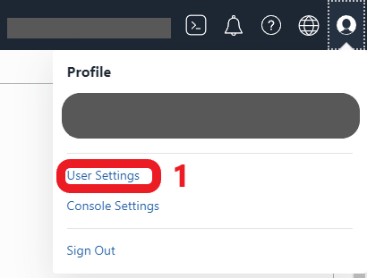
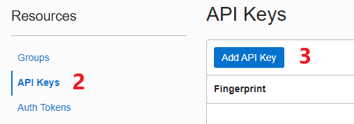
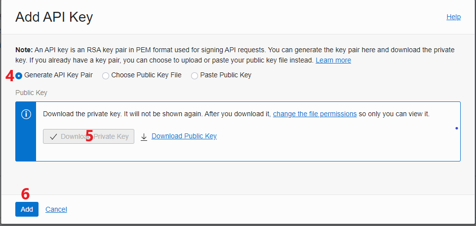
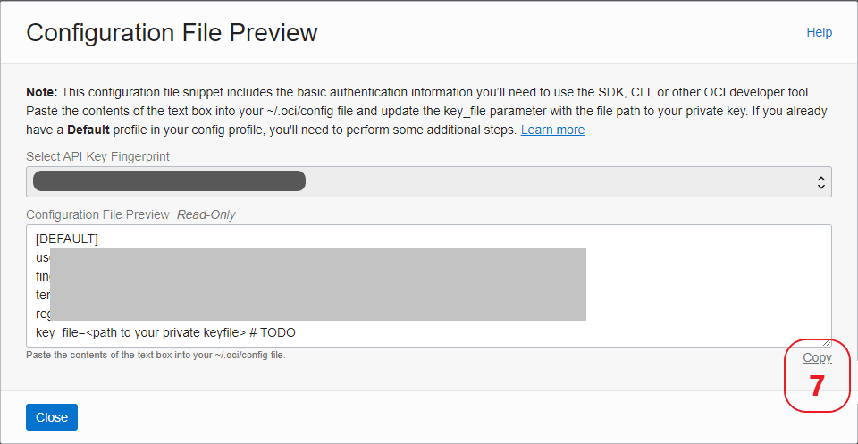

## Installation
Requirement: Python 3.8, 3.9
Install requests and oci (Oracle Cloud Infrastructure Python SDK) library (pip if on windows)
```
pip3 install requests
pip3 install oci
```
or
```
pip3 install -r requirements.txt
```

Clone the repository:
```
git clone https://github.com/chacuavip10/oci_python_examples_public
```

## Generating API key
After logging in to [OCI Console](http://cloud.oracle.com/), click profile icon and then "User Settings"



Go to Resources -> API keys, click "Add API Key" button



"Generate API Key Pair", click "Download Private Key", save it as (rename) ***oci_private_key.pem*** and then "Add".



Copy the contents from text-area and save it to file with a name "config", change last line `key_file=` to `key_file=<Full path to oci_private_key.pem with out the bracket>`. Put both file in the ***env*** folder in the repo.



Content of config file should look like this
```
[DEFAULT]
user=ocid1.user.oc1..hidden
fingerprint=d3:f9:c7:6c:be...hidden
tenancy=ocid1.tenancy.oc1...hidden
region=ap-hidden
key_file=C:\somepath\oci_python_examples_public\env\oci_private_key.pem
```

## Generate ssh public key

To use current ssh public key:
```
cat ~/.ssh/id_rsa.pub
```
Or create new one:
```
ssh-keygen
```

## Running
cd into `oci_python_examples`
`python3 main.py`

### \[Optional] Telegram setting
- config bot_api and chat_id according to the guide
https://medium.com/@ManHay_Hong/how-to-create-a-telegram-bot-and-send-messages-with-python-4cf314d9fa3e
  - Create bot with BotFather, get the API key
  - Start the bot via conversation/chat with command /start
  - Get chat_id: https://api.telegram.org/bot<yourtoken>/getUpdates   if you don't get the chat_id, send a message to the bot and retry
  - Start a chat with your bot, add [@get_id_bot](https://telegram.me/get_id_bot), and issue the `/my_id` command
  - Get bot_id and chat_id from 2 previous steps

### Time interval between each request
- To prevent DDoS, default setting for interval between request is 300 seconds